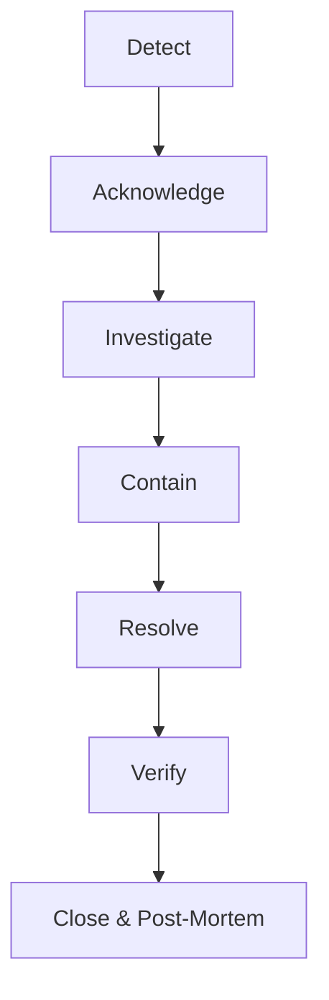

# FASE 29: OPERATIONS, GOVERNANCE & SCALABILITY

Este documento establece el marco conceptual y estratégico para la operación a largo plazo de ELECTORAL360. 

## 1. Governance Model & Responsibility Matrix
- **Enterprise Architect / CISO:** Define políticas de seguridad, arquitectura en la nube y aprueba pases a producción.
- **SRE / DevOps Lead:** Gestiona CI/CD, infraestructura como código (Terraform), Cloudflare, Kubernetes/Docker y Base de datos.
- **Incident Commander:** Lidera la respuesta a incidentes de Nivel 1 (Críticos).
- **Product Owner:** Prioriza mejoras (Backlog, Deuda Técnica).
- **Auditor:** Rol de solo lectura para fiscalizar registros, logs de Base de Datos y trazabilidad de votos/datos.

## 2. Incident Response Workflow

## 3. Election Day Mode (High Traffic)
- **Change Freeze:** Prohibición absoluta de despliegues 48 horas antes de una elección.
- **Escalabilidad:** Auto-scaling groups al 100% de capacidad pre-calentados.
- **Database:** Réplicas de lectura (Read Replicas) activadas para soportar consultas masivas de resultados.
- **WAF:** Modo "Under Attack" habilitado preventivamente en Cloudflare.

## 4. Disaster Recovery (DRP) & Business Continuity (BCP)
- **RTO (Recovery Time Objective):** < 15 minutos para caída total de capa API.
- **RPO (Recovery Point Objective):** < 5 minutos de pérdida de datos aceptable (via WAL streaming de PostgreSQL).
- **Estrategia Fallback:** Si el backend cae, Cloudflare servirá una página estática "Modo Degradado" informando a los usuarios, manteniendo el Frontend SPA activo.

## 5. Capacity Planning
- Frontend: Ilimitado (Edge CDN Vercel/Cloudflare).
- Backend: Auto-escalado horizontal basado en CPU > 70%.
- Base de Datos: Escalado vertical inicial; particionamiento de tablas (Partitioning) por `campaña` o `territorio` si el histórico supera los 50GB.
