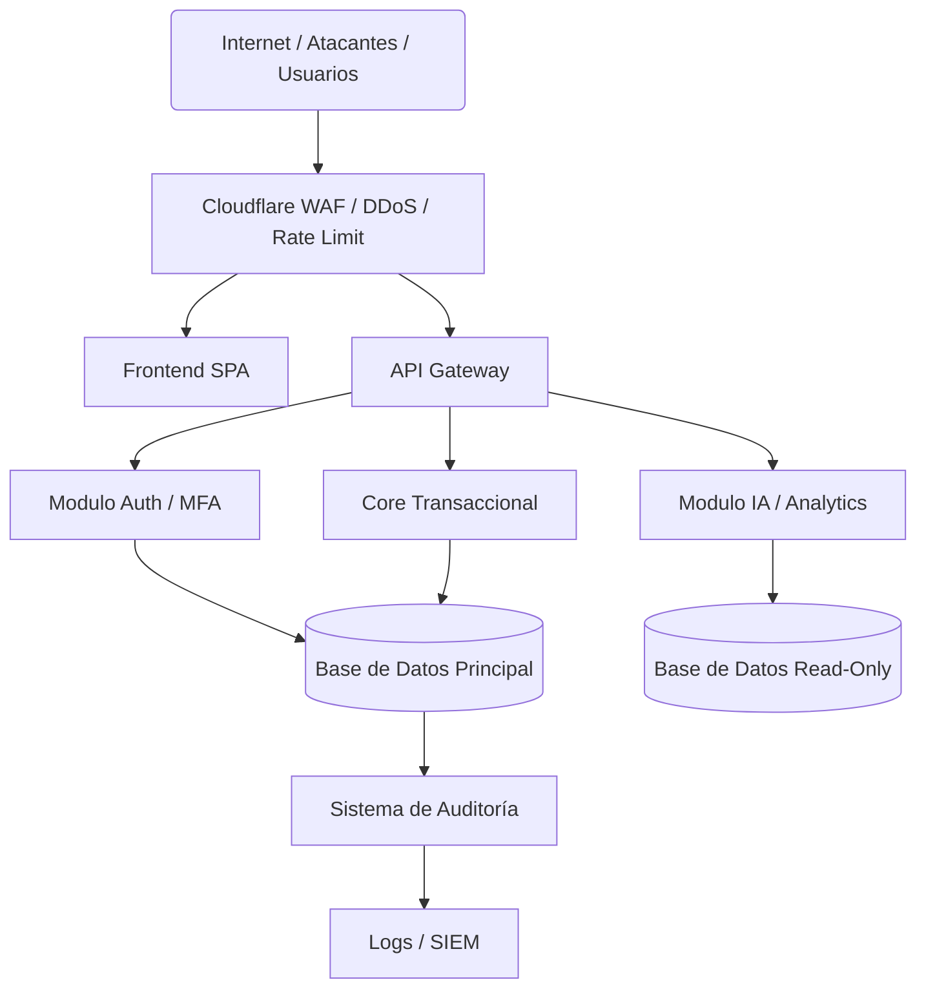

# Arquitectura de Seguridad (Fase 18) - Electoral360

Este documento rige la postura de ciberseguridad y modelo *Zero Trust* de Electoral360.

## 1. Zero Trust y Defensa en Profundidad
El sistema asume que la red y los dispositivos de los usuarios están comprometidos. Toda solicitud se somete a:
- **Identity Gate:** JWT con firma criptográfica asimétrica, validación de expiración (TTL) y verificación de rotación/revocación de sesión activa.
- **Authorization Gate:** Control de Acceso Basado en Roles (RBAC) evaluado a nivel de base de datos y backend (nunca delegado al frontend).
- **Tenant Isolation:** Aislamiento forzoso de datos a través de `organization_id` y permisos geográficos (`territory_id`).

## 2. Protección de la Ruta Crítica Electoral
- Todo registro de `ElectionAct`, `VoteResult` y `AuditLog` sigue un modelo de escritura inmutable (Append-only).
- **Fail Closed:** Si falla un control de seguridad (Ej. servicio de autorización inalcanzable), la transacción se deniega (`DENY BY DEFAULT`).

## 3. Arquitectura Final (Teórica a Desplegar)

## 4. Gestión de Archivos (Actas)
- Escaneo de MIME-types mágicos, restricción de tamaño y políticas estrictas de CORS.
- Almacenamiento en Object Storage aislado con acceso exclusivo vía `Short-lived Signed URLs`.

## 5. Pruebas y Certificaciones (Requeridas para Go-Live)
- **Pentesting:** Prueba de Penetración de Caja Blanca/Gris.
- **Vulnerability Scanning:** Análisis de Dependencias (SCA) y SAST.
- **Red Team:** Ejercicio Tabletop de respuesta ante incidentes (Exfiltración o Ransomware).
